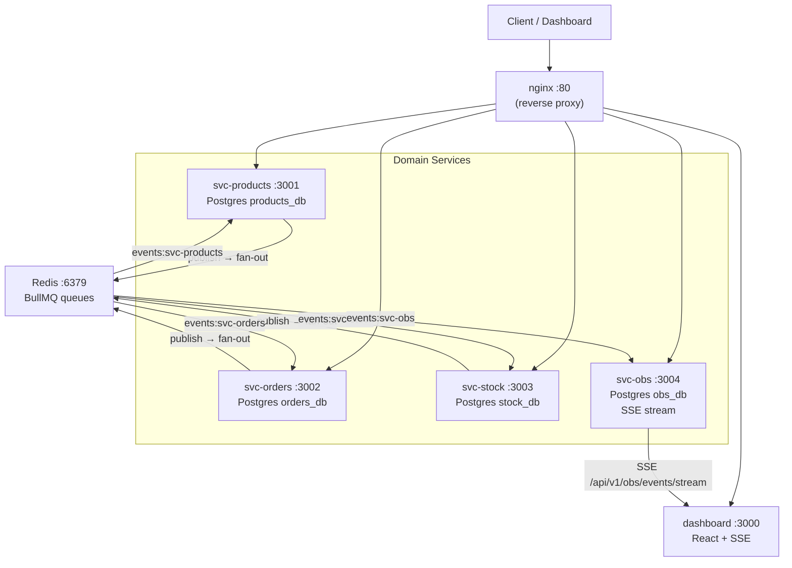
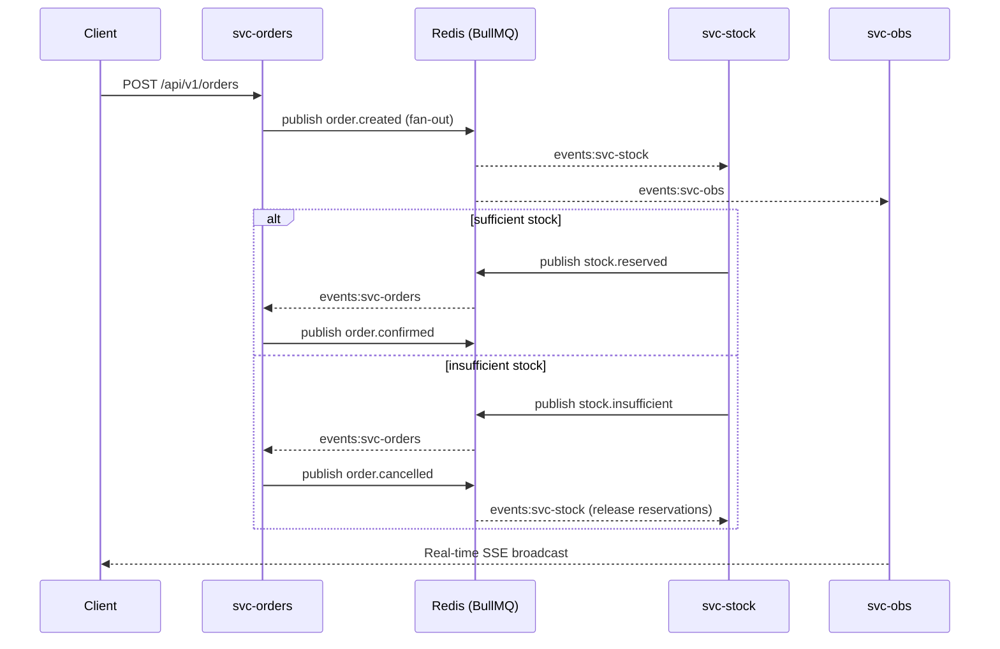
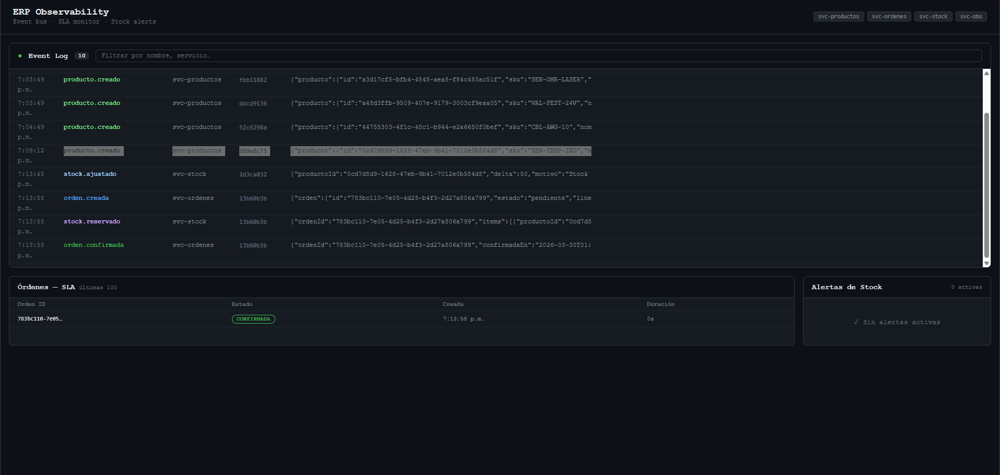
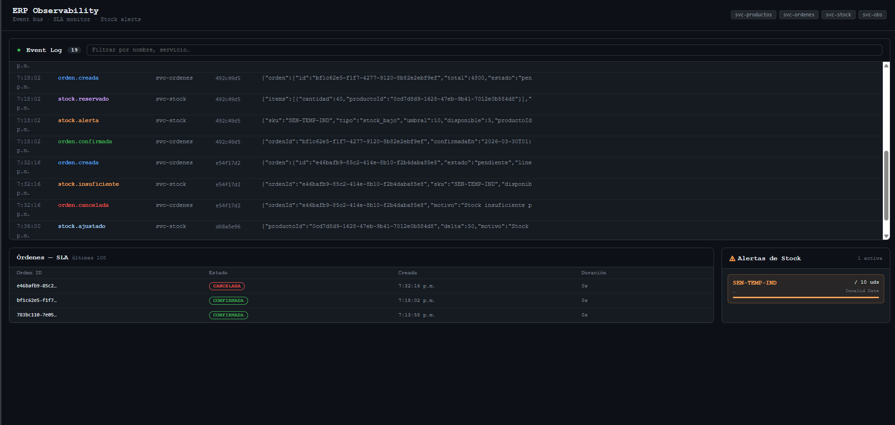
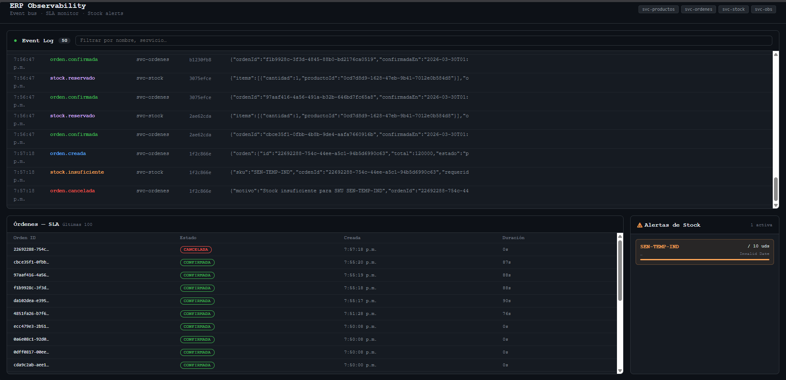
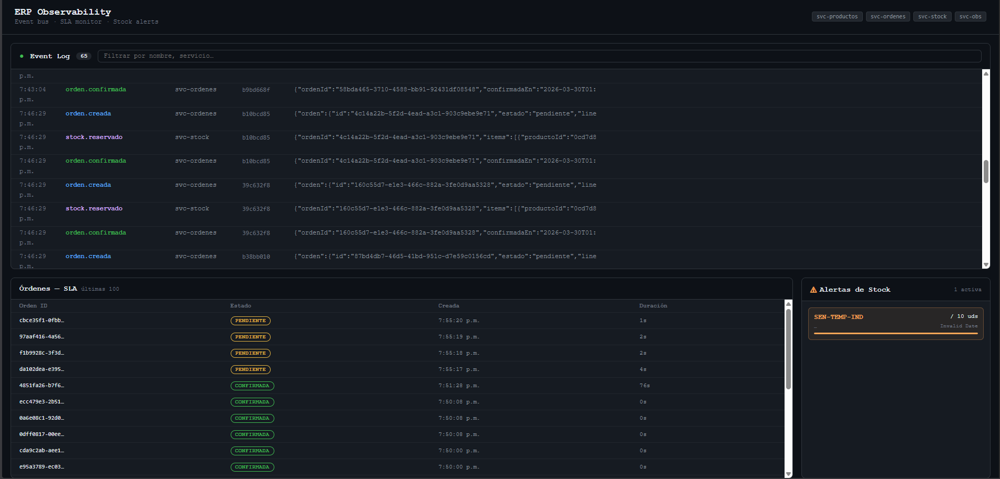
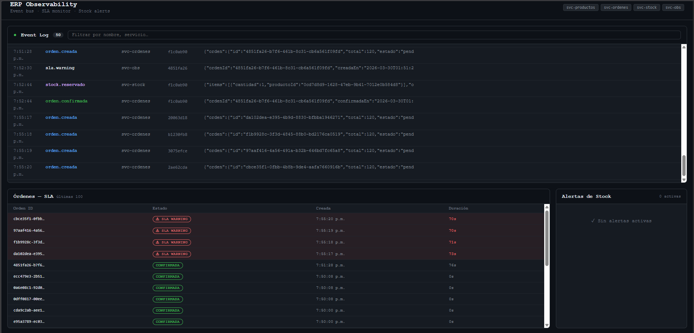
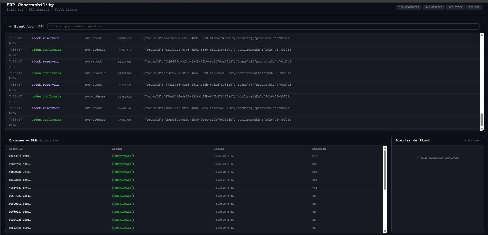

# Inventory ERP — Event-Driven Microservices
> **Event-driven microservices architecture with Saga orchestration and real-time observability.**

[](https://github.com/Francisco-cor/Inventory_ERP_BullMQ/actions/workflows/ci.yml)


An inventory ERP built with strict data isolation, a verifiable event bus, and native real-time monitoring.

---

## Architecture



### Order Flow



### Distributed Transactions (Saga Pattern)

The system implements the **Saga Pattern (Choreography)** to manage distributed transactions. Each service reacts asynchronously to events, ensuring that an order only transitions to `confirmed` if stock was successfully reserved. This approach maintains eventual consistency without the need for a centralized orchestrator, leveraging BullMQ for reliable event delivery.

---

## Tech Stack

Scalable microservices architecture focused on high availability and end-to-end observability.

- **Backend**: Node.js, TypeScript, Fastify (High-performance framework).
- **Messaging / Events**: BullMQ, Redis (Pattern: **Saga Choreography**).
- **Persistence**: PostgreSQL (**Polyglot Persistence** / DB-per-service).
- **Observability**: Server-Sent Events (**SSE**), React (Real-time Dashboard).
- **Infrastructure**: Nginx (Reverse Proxy), Docker & Docker Compose.
- **Testing**: Jest, Supertest (**E2E Testing**).

---

## Design Decisions

### 1. Database per Service
Each service has its own Postgres instance. No cross-service JOINs, no cross-database foreign keys. If `svc-orders` goes down, `svc-stock` remains functional. Denormalized data in `order_lines` (SKU, price) captures the state at the time of the transaction.

### 2. Fan-out via Dedicated Queues
`publish()` writes events to `events:svc-orders`, `events:svc-stock`, `events:svc-products`, and `events:svc-obs` simultaneously. Each service consumes only its own queue. This eliminates "competing consumers" bugs that occur when multiple workers share a single queue for different purposes.

### 3. Explicit Idempotency
Each service maintains a `received_events` table. Before processing any event, it inserts the `event_id`. If it already exists, the event is discarded. This guarantees at-least-once delivery without double-processing effects (BullMQ with retries + exponential backoff).

### 4. Trace Correlation
Every event carries a `correlationId` propagated from the original HTTP request. The `svc-obs` event log allows reconstructing the full request tree: `order.created → stock.reserved → order.confirmed`.

### 5. SLA as a Job, Not Client Polling
A BullMQ repeating job in `svc-obs` checks every 30s for orders in `pending` state older than 60s. These are marked as `sla_warning` and transmitted via SSE. The client does not poll.

---

## Services

| Service | Port | Responsibility |
|---|---|---|
| svc-products | 3001 | Product catalog, emit `product.*` |
| svc-orders | 3002 | Order state (state machine), emit `order.*` |
| svc-stock | 3003 | Stock, reservations, alerts, emit `stock.*` |
| svc-obs | 3004 | Event log, SSE stream, SLA monitor |
| dashboard | 3000 | Real-time observability UI |
| nginx | 80 | Reverse proxy, header correlation |

### Key API Endpoints

```
POST   /api/v1/products                  → create product
GET    /api/v1/products                  → list products

POST   /api/v1/orders                    → create order (triggers event flow)
GET    /api/v1/orders/:id                → order status
POST   /api/v1/orders/:id/cancel         → cancel order

GET    /api/v1/stock/:productId          → product stock
POST   /api/v1/stock/:productId/adjust   → manual stock adjustment
GET    /api/v1/stock/alerts              → low stock alerts

GET    /api/v1/obs/events/stream          → SSE stream of all events (real-time)
GET    /api/v1/obs/events                 → paginated event log
GET    /api/v1/obs/sla/alerts             → orders with SLA risks

GET    /admin/orders/dlq                  → svc-orders dead-letter queue
GET    /admin/stock/dlq                   → svc-stock dead-letter queue
```

---

## 🔍 Observability & System Resilience

The system implements an end-to-end observability stack for real-time tracking and automated fault detection.

### 1. Global Visibility

**Technical Context**: Real-time Event Log powered by **Server-Sent Events (SSE)**. It reconstructs the complete execution trace across all services without page reloads.

### 2. Inventory Intelligence

**Technical Context**: Proactive Alerting system triggers based on configurable thresholds (e.g., 10 units). Internal events drive dynamic dashboard updates via SSE for immediate stock management.

### 3. Distributed Business Logic (Error Handling)

**Technical Context**: Distributed logic for event compensation. Failed stock reservations trigger automatic state transitions to `cancelled` in the orders service, ensuring systemic consistency across domain boundaries.

### 4. SLA Monitoring & Recovery Flow
Automated sequence for latency detection and state recovery.

#### Step A: Order Pending

Newly created orders enter a **PENDING** state while the event bus handles initial propagation.

#### Step B: Critical SLA Warning

The **SLA Monitor** (BullMQ repeatable job) detects delays exceeding 60 seconds and flags the record, alerting operators to potential service bottlenecks.

#### Step C: Automated Recovery

Systemic self-healing: Orders transition to **CONFIRMED** automatically as soon as downstream consumers process the accumulated backlog.

---

## Running with Docker

```bash
docker compose up --build -d
```

This starts: 4 Postgres instances, Redis, 4 Node.js services, nginx, and the React dashboard.

```bash
# Verify health
curl http://localhost/health/products
curl http://localhost/health/orders
curl http://localhost/health/stock
curl http://localhost/health/obs

# View the dashboard
open http://localhost:3000

# View Swagger docs for each service
open http://localhost/products/docs
open http://localhost/orders/docs
open http://localhost/stock/docs
```

---

## E2E Testing

Tests run against real services in Docker to verify the complete flow:

```bash
# Ensure services are running
docker compose up -d

# Run tests
cd tests/e2e && npm install && npm test
```

Verifications include:
1. Create product → stock automatically initialized via event.
2. Adjust stock.
3. Create order → initial state `pending`.
4. Order transitions to `confirmed` (via BullMQ events).
5. Stock decremented by the correct amount.
6. `svc-obs` recorded the complete event chain.

It also verifies failure flows: when stock is insufficient, the order transitions to `cancelled` and `svc-obs` logs `stock.insufficient`.

---

## CI/CD

GitHub Actions runs E2E tests on every push/PR to `main`:
- Spins up all services with `docker compose up --build`.
- Waits for nginx to respond at `/health/*`.
- Executes E2E tests against `http://localhost:80`.

See `.github/workflows/ci.yml`.

---

## Additional Documentation

- [ADR #001](docs/adr/001-polyglot-persistence.md) — Database per service
- [ADR #002](docs/adr/002-state-machine-orders.md) — Explicit state machine for orders
- [ADR #003](docs/adr/003-event-bus-vs-http.md) — Event bus vs synchronous HTTP
