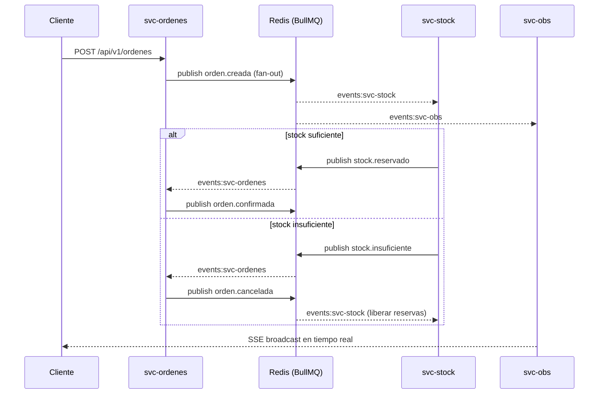

# Inventory ERP — Event-Driven Microservices

Un ERP de inventario construido con separación real de datos, un bus de eventos verificable y observabilidad en tiempo real.

---

## Arquitectura


### Flujo de una orden



---

## Decisiones de diseño

### 1. Base de datos por servicio
Cada servicio tiene su propio Postgres. No hay JOINs entre servicios, no hay foreign keys cruzadas. Si svc-ordenes cae, svc-stock sigue funcionando. Los datos desnormalizados en `lineas_orden` (SKU, precio) capturan el estado en el momento de la transacción.

### 2. Fan-out por colas dedicadas
`publish()` escribe el evento en `events:svc-ordenes`, `events:svc-stock`, `events:svc-productos` y `events:svc-obs` simultáneamente. Cada servicio consume solo su propia cola. Esto elimina el bug de competing consumers que aparece cuando varios workers comparten una sola cola.

### 3. Idempotencia explícita
Cada servicio mantiene una tabla `eventos_recibidos`. Antes de procesar cualquier evento, inserta el `event_id`. Si ya existe, lo descarta. Esto garantiza at-least-once delivery sin efectos dobles (BullMQ con retry + backoff exponencial).

### 4. Correlación de trazas
Cada evento lleva un `correlationId` propagado desde la petición HTTP original. El event log de svc-obs permite reconstruir el árbol completo de un request: `orden.creada → stock.reservado → orden.confirmada`.

### 5. SLA como job, no como polling del cliente
Un BullMQ repeating job en svc-obs revisa cada 30 s las órdenes en estado `pendiente` con más de 60 s de antigüedad. Las marca como `sla_warning` y las transmite via SSE. El cliente no hace polling.

---

## Servicios

| Servicio | Puerto | Responsabilidad |
|---|---|---|
| svc-productos | 3001 | Catálogo de productos, emit `producto.*` |
| svc-ordenes | 3002 | Estado de órdenes (state machine), emit `orden.*` |
| svc-stock | 3003 | Stock, reservas, alertas, emit `stock.*` |
| svc-obs | 3004 | Event log, SSE stream, SLA monitor |
| dashboard | 3000 | UI de observabilidad en tiempo real |
| nginx | 80 | Reverse proxy, correlación de headers |

### API endpoints clave

```
POST   /api/v1/productos                  → crear producto
GET    /api/v1/productos                  → listar productos

POST   /api/v1/ordenes                    → crear orden (dispara el flujo de eventos)
GET    /api/v1/ordenes/:id                → estado de una orden
POST   /api/v1/ordenes/:id/cancelar       → cancelar orden

GET    /api/v1/stock/:productoId          → stock de un producto
POST   /api/v1/stock/:productoId/ajustar  → ajuste manual de stock
GET    /api/v1/stock/alertas              → alertas de stock bajo

GET    /api/v1/obs/events/stream          → SSE stream de todos los eventos (tiempo real)
GET    /api/v1/obs/events                 → event log paginado
GET    /api/v1/obs/sla/alerts             → órdenes con SLA en riesgo

GET    /admin/ordenes/dlq                 → dead-letter queue de svc-ordenes
GET    /admin/stock/dlq                   → dead-letter queue de svc-stock
```

---

## Observabilidad

El dashboard en `http://localhost:3000` muestra:

- **Event log en tiempo real** — cada evento con timestamp, tipo, servicio origen y correlationId. Sin recargar la página (Server-Sent Events).
- **Tabla de órdenes** — estado actual de cada orden, con duración. Las órdenes que superan 60 s sin resolverse se resaltan en rojo como **⚠ SLA WARNING**.
- **Alertas de stock** — SKUs con nivel bajo, con barra de progreso y timestamp.

---

## Levantar con Docker

```bash
docker compose up --build -d
```

Esto levanta: 4 Postgres, Redis, 4 servicios Node.js, nginx y el dashboard React.

```bash
# Verificar que todo está healthy
curl http://localhost/health/productos
curl http://localhost/health/ordenes
curl http://localhost/health/stock
curl http://localhost/health/obs

# Ver el dashboard
open http://localhost:3000

# Ver Swagger de cada servicio
open http://localhost/productos/docs
open http://localhost/ordenes/docs
open http://localhost/stock/docs
```

---

## Tests E2E

Los tests corren contra los servicios reales en Docker y verifican el flujo completo:

```bash
# Asegúrate de que los servicios estén corriendo
docker compose up -d

# Correr los tests
cd tests/e2e && npm install && npm test
```

El test verifica:
1. Crear producto → stock inicializado automáticamente via evento
2. Ajustar stock
3. Crear orden → estado inicial `pendiente`
4. Orden transiciona a `confirmada` (via eventos BullMQ)
5. Stock decrementó en la cantidad correcta
6. svc-obs registró el chain de eventos completo

También verifica el flujo de error: cuando no hay stock, la orden pasa a `cancelada` y svc-obs registra `stock.insuficiente`.

---

## CI/CD

GitHub Actions ejecuta los E2E tests en cada push/PR contra `main`:
- Levanta todos los servicios con `docker compose up --build`
- Espera a que nginx responda en `/health/*`
- Ejecuta los tests E2E contra `http://localhost:80`

Ver `.github/workflows/ci.yml`.

---

## Documentación adicional

- [ADR #001](docs/adr/001-polyglot-persistence.md) — Base de datos por servicio
- [ADR #002](docs/adr/002-state-machine-ordenes.md) — State machine explícita para órdenes
- [ADR #003](docs/adr/003-event-bus-vs-http.md) — Bus de eventos vs HTTP síncrono
